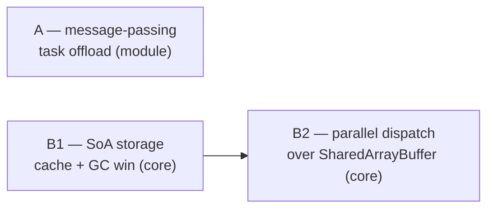

# Parallelism & SoA storage (multi-threading) — design capture, deferred

Expands the "Multi-threading / worker-based parallelism" Non-goal in
[../roadmap/ecs-module-backlog.md](../roadmap/ecs-module-backlog.md#non-goals-declined).
That entry declined the topic on a single argument (`structuredClone`
copy cost). This doc records the fuller picture so the question isn't
re-litigated from scratch: what would actually be built, in what order,
what each piece is worth **on its own**, and how each would be proven.

Nothing here is scheduled. This is a design capture, kept deferred until
a prototype produces the evidence each step demands (see
[Evidence-first sequence](#evidence-first-sequence)).

## Two facts that shape everything

- **Component data is objects in a `Map`.** `ComponentStore<T>` holds each
  component as a JS object in a `Map<EntityId, T>`
  ([../../src/component-store.ts](../../src/component-store.ts)). It is *not*
  a Structure-of-Arrays over typed buffers. This is the real blocker for
  true shared-memory parallelism — not `structuredClone`.
- **The scheduler already knows read/write sets.** Every `SchedulableSystem`
  declares `reads` / `writes`, documented as the "Foundation for future
  parallel execution"
  ([../../src/scheduler.ts](../../src/scheduler.ts)). The dependency
  metadata needed to auto-dispatch disjoint systems already exists.

## Three levers, not one

The backlog entry conflates two unrelated things. There are really three,
and they serve different purposes:

| Step | What it is | Standalone value | Depends on | Core / module |
|---|---|---|---|---|
| **A** | Message-passing worker(s) — offload whole jobs | Yes | nothing | **module** (worker-pool helper) |
| **B1** | SoA / typed-array "hot component" storage | **Yes, large** (cache + GC wins, single-threaded) | nothing | **core** (`ComponentStore`) |
| **B2** | Parallel system dispatch over SAB-backed SoA | Only as a multiplier on B1 | **B1** | **core** (scheduler + world) |

A is independent. B1 is independent and worth doing alone. B2 is the only
step that requires a predecessor.

### Task parallelism (A) vs data parallelism (B2)

A is **not** a naive version of B2 — they solve different problems and both
are legitimate permanent choices:

- **A = task parallelism.** Distinct, self-contained jobs whose input/output
  is small relative to the compute: pathfinding / flow-field solves,
  procedural generation, AI planning, asset decoding, audio DSP. The copy
  across the boundary is negligible; A is simpler, safer, and more portable
  than B2 (no cross-origin isolation, no data races, no manual byte layout).
  It is also the *only* option for non-numeric work — a `SharedArrayBuffer`
  holds only numbers.
- **B2 = data parallelism.** The same operation across a large uniform
  array ("advance 10k positions", "test 10k pairs"). Needs shared typed
  memory (hence B1).

The only genuinely naive move is using A to parallelize the per-tick ECS
loop — that specific use is dominated by copy cost. A for batch jobs is
battle-tested (it is how most JS games offload today, since SAB was
disabled for years and still needs `COOP`/`COEP` headers).

## A — message-passing worker offload (module)

**Shape.** A small worker-pool helper: hand it a job (a pure function +
serializable input), get a `Promise` of the result back. Consumers opt in
per job; nothing runs in a worker by default.

**Electron.** Works. Electron is Chromium + Node — Web Workers are native.
(Node `worker_threads` also exist, but Web Workers keep one codebase
running in both browser and Electron.)

**Pros.** No frame stalls for heavy one-offs; simple; safe; portable;
handles non-numeric work.

**Cons.** Copy cost per job → unsuitable for per-tick simulation; result
latency (answer arrives a frame or more later).

## B1 — SoA / hot-component storage (core)

**Shape.** A hybrid store — see the [B1 design sketch](#b1-design-sketch--target-middle)
for the full design (target: "Middle"). Keep the `Map`-of-objects for
components that can't be columnized; store all-numeric components as
**Structure-of-Arrays** — one contiguous `Float32Array` per field, indexed
by a dense slot, with an entity↔slot table. Which store a component uses is
**inferred from its schema**, not a per-component opt-in flag.

**Value is independent of parallelism.** Unity DOTS, flecs, EnTT, and Bevy
adopted this layout for the *single-threaded* cache wins first; parallelism
came later.

**Pros (single-threaded).**

- **Iteration speed:** streaming a contiguous typed array is cache-friendly
  and prefetcher-friendly; the `Map` version chases a pointer per entity.
  Routinely 2–10× on hot loops.
- **No per-entity GC:** one big allocation instead of thousands of tracked
  objects; writing a component is `xs[slot] = v` — nothing for the GC to
  scan. Removes spawn/kill stutter at high counts.
- **Small, predictable footprint.**

**Cons (real, beyond effort).**

- Only fixed-width numbers fit → strings / arrays / nested objects stay in
  the `Map`, so core carries **two storage paths**.
- Requires an up-front declared numeric schema per hot component (stricter
  than today's opaque `serialize` / `deserialize<T>`).
- Slot bookkeeping: free-list / swap-remove / hole handling; add/remove
  component is no longer trivial.
- Harder to inspect (a `Float32Array` + slot table vs a `Map` of objects).
- A philosophical pivot away from the object-first `simpleComponent` model.

The hybrid (schema-inferred per component) is what keeps the cons
contained: the components that can't be columnized, and the object-view
compatibility layer, mean most systems never have to change.

## B2 — parallel system dispatch (core, needs B1)

**Shape.** Back B1's typed arrays with a `SharedArrayBuffer`; let the
scheduler auto-dispatch systems whose `reads` / `writes` sets are disjoint
onto a worker pool. Opt-in at the world/scheduler level ("enable parallel
mode") — consumers do **not** rewrite systems; the existing read/write
metadata is what makes a system parallel-safe.

**Electron.** Works, and is the *easier* SAB target — you control the
`COOP`/`COEP` headers / launch flags that a plain browser makes fiddly.

**Pros.** ~Nx on genuinely CPU-bound simulation (bounded by core count).

**Cons.** Only helps work that is *already* CPU-bound after B1; worker sync
overhead can make a light kernel *slower* in parallel; only SoA components
can be shared; correctness rests on accurate `reads` / `writes` declarations.

## Would this help a "vampire survivors"-style game?

Partially, and **not first.** Two separate bottlenecks:

- **Simulation** of thousands of entities: the big wins are B1 (cache + no
  GC) and the spatial broadphase already in
  [../../src/spatial-structure.ts](../../src/spatial-structure.ts). A single
  thread with tight data layout handles 10k+ at 60fps. B2 adds a core-count
  multiplier *only after* B1, and only if still CPU-bound.
- **Rendering** thousands of sprites is a draw-call / fill-rate problem.
  Workers do not fix it (draw happens on the main thread; `OffscreenCanvas`
  moves it to *one* worker — offloading, not parallelism).

So for a VS-like: B1 is the lever that matters, B2 is the last resort, and
rendering needs a separate batching answer.

## Proof-of-benefit demos

Each lever produces a *different kind* of win, so one FPS number can't show
all three. Three minimal, boids-style demos, each with a toggle:

- **A — "no stutter" (smoothness, not FPS).** A few hundred drifting dots +
  a "recompute" button firing a deliberately heavy job (~200 ms). Toggle
  OFF (main thread) → the animation visibly hitches; ON (worker) → stays
  smooth, result pops in when ready. Watch a **frame-time graph**: one giant
  spike vanishes. Average FPS barely moves — the spike is the story.
- **B1 — "SoA vs Map" (throughput at scale).** Slider ramps entity count
  (1k → 100k), integrate every tick, render as 1px dots (render kept cheap
  so *simulation* is the bottleneck). Toggle Map-store ⟷ SoA-store for
  pos/vel. Watch **sim ms/tick** (not FPS — vsync hides headroom): the `Map`
  path climbs with a GC sawtooth; SoA stays flat. Ramp until the `Map`
  version drops frames.
- **B2 — "single vs parallel" (throughput × cores).** B1's scene plus a
  deliberately heavy, embarrassingly-parallel per-entity kernel (naive
  attraction to K attractors, no spatial shortcut). Toggle single ⟷ N-worker
  dispatch over the SAB arrays. Watch **sim ms drop ~Nx**. A "kernel weight"
  slider reveals the crossover where parallel starts to beat single-thread.

B1 and B2 can share one stress example with two checkboxes (SoA on/off,
parallel on/off), since B2 needs B1 — you watch ms/tick step down twice. A
is a separate example (its win is smoothness, not throughput).

## Evidence-first sequence

The engine ships nothing speculative (canon + real consumers). The demos
above need the features, and the features need a proven bottleneck —
chicken-and-egg. The break: build each **harness against today's code
first**; if it visibly chokes, that is the evidence that authorises the
build, with zero speculative engine code written.

- [x] Build the B1 stress harness on the **current `Map` store**; confirm it
      chokes (frame drops + GC sawtooth) at high entity count. → justifies B1.
      Shipped as [`examples/stress-storage`](../../examples/stress-storage/):
      Map store vs SoA typed arrays toggle. Confirmed — at 1M entities the SoA
      path holds a steady 75 fps while the Map store is unusable.
- [x] If justified, design + build B1 (hybrid schema-inferred SoA storage);
      re-run the harness to quantify the win. **Shipped** — `ColumnStore`
      (typed-array columns, swap-remove, id-bound write-through view),
      `ComponentStoreLike` interface, schema-inferred storage in
      `registerComponent`, `world.getColumnStore` fast-path accessor, and the
      motion integration columnar fast path. Full suite (1012) green; harness
      confirms flat sim at millions of entities.
- [ ] Build the A "main-thread stall" harness; confirm the stall on the main
      thread. → justifies A (a module).
- [ ] Build the B2 fat-kernel harness on B1; confirm it is core-bound single-
      threaded. → justifies B2 (SAB dispatch).

## B1 design sketch — target: "Middle"

Grounded in the current code. This pins the *how* so the eventual build
doesn't ossify a wrong shape in `ComponentStore` — the most load-bearing
primitive in the engine.

Chosen target is **Middle** (of three considered — Pragmatic / Middle /
Ideal). Middle builds the real data-oriented storage foundation now, keeps
an object-view compatibility layer so most systems don't have to change, and
leaves **Ideal** (columnar query as the default, systems written as column
loops) reachable *later, incrementally, with no storage redo*. It is the
storage foundation the roadmap's archetype cache
([core-engine-roadmap §3.1](../roadmap/core-engine-roadmap.md#31-archetype-cache))
and schema-first components eventually sit on top of.

> Refines the higher-level "opt-in per component" wording earlier in this
> doc: storage is **inferred from the schema**, not a per-component opt-in
> flag or a duplicated `SoA` component type.

### The central tension (the decision the build resolved)

Every consumer today does `store.get(id)` → a **mutable object** and mutates
it **in place**: `pos.x += vx * dt`, `pos.x = …` (verified across the
examples and modules — the idiom is universal). The columnar win comes
*precisely from not having per-entity objects*. So columnar storage
**cannot preserve the get()-mutate idiom at full speed** — that is the real
design problem, and the one a blind port would have hit head-on. Middle
resolves it by keeping the idiom *working* (via a view) while making the
*fast* path a separate, opt-in column API.

### Storage is inferred from the schema — one component def, no duplication

`PositionDef` stays **one** definition, shared by every consumer. Storage
layout is **not** a user dial and **not** a duplicated `PositionSoADef` —
the engine picks it from the component's schema:

- **All-numeric schema** (every field `'number'`) → **columnar** store
  (typed-array columns). Position, Velocity, etc.
- **Any non-numeric field** (string / boolean-heavy / nested) → **object**
  store (today's `Map<id, T>`).

Two representations exist even in a from-scratch JS ECS for a language
reason, not an ergonomics one: you cannot pack a string or a nested object
into a `Float32Array`. So the object store is kept **only** for components
that genuinely can't be columnized — decided automatically, never chosen by
the consumer. A hand-written opaque `ComponentDef` (custom
`serialize`/`deserialize`) is treated as non-numeric → object store.

### Access surfaces — uniform `get`/`set`, opt-in columns

Both stores implement the **same** access interface, so `world.query`,
`getStore`, the spatial index, and save all work regardless of layout:

- **Uniform `get(id)` / `set(id, value)`** — object store returns the live
  object; columnar store returns a **shared write-through flyweight** whose
  getters/setters hit `column[slot]` (valid only until the next store op;
  DEV guard against holding two live flyweights from one store). Systems
  written this way (most of them, incl. the transform/collision modules)
  are **storage-agnostic** — a component flipping to columnar doesn't break
  them, and they gain the storage/GC win. They do **not** get the full
  *iteration* win (the query still visits entity-by-entity).
- **Columnar fast path (columnar store only, opt-in per hot loop)** —
  `column(field)` → raw `Float32Array` + `slotOf(id)`, or a
  `forEach((slot, cols) => …)`. Zero-alloc. The 2–3 hottest loops (movement
  integration) adopt this for the full win; everything else stays on the
  uniform API.

So Middle delivers the **full storage/memory/GC win** for any columnar
component immediately (its stored data is no longer objects), and the
**full iteration win** only where a loop opts into columns.

### Storage internals (columnar store)

- One `Float32Array` per field (grow by doubling), a `Map<EntityId, slot>`
  and a `slot → EntityId` reverse array.
- Delete = **swap-remove**: move the last slot into the hole, fix the
  reverse map. Dirty tracked as a `Set<EntityId>`. `size` = live count.
- `Float32` columns by default; opt-in `Float64` where precision needs it.

### Lifecycle / spatial / save must stay intact

- `subscribe('set' | 'delete' | 'validate')` fire on slot alloc / free /
  repack. `world.ts` already wires a `set` subscription — unchanged.
- Spatial `onMove` + grid sync stay driven by the motion system callback;
  positions readable via flyweight or column.
- `toSerialized` / `fromSerialized` reproduce the same `[id, { fields }]`
  tuples from the columns → **save format is byte-identical** to the object
  store's; a parity test enforces it.

### The path to Ideal (later, gradual, no storage redo)

Ideal = the **query itself yields columns**, systems are written as column
loops by default, and `get(id)` is demoted to an escape hatch. Middle
already builds every storage piece Ideal needs; the only remaining step is
reshaping `world.query` to yield columns and migrating systems from
view-style to column-loop-style **one at a time** — both read the same
columnar storage underneath, so nothing built in Middle is thrown away (the
view API survives as the escape hatch). An independent cheap win that also
serves Ideal: `query.ts` allocates `Array.from({ length })` **per entity
per tick** — worth removing on its own.

### Rollout

1. Land the columnar store + schema-inferred storage selection in
   `registerComponent`; object store untouched (zero consumer impact —
   all-numeric components silently become columnar, read through the
   uniform `get`/`set`).
2. Adopt the columnar fast path in the motion module's integration system
   (the first full-win loop).
3. The stress harness's Map/SoA toggle becomes **harness-local**: the fast
   side points at the real engine's columnar store; the slow side is a
   throwaway `Map<id, {x,y}>` baseline. The engine no longer ships a slow
   object-mode for numeric data just to enable the A/B.

### Test strategy

- **Parity** — for a random workload, the columnar and object stores yield
  identical `query` results and identical `toSerialized` output.
- **Slot recycle** — create / delete / re-create keeps the reverse map and
  free-list correct, no stale slot.
- **DEV flyweight-aliasing guard** fires when two live flyweights are held.
- **Perf smoke** (non-gating) — sim ms/tick under a threshold at N.

### Deferred optimizations (post-Middle, surfaced by the stress harness)

The Middle slice shipped; these are follow-ups the `examples/stress-storage`
harness made concrete. None blocks correctness (full suite green); each is a
perf lever with a wrinkle, to be taken deliberately.

- **Cheaper view construction.** `get()` on a columnar store materializes a
  write-through view via `Object.defineProperties` per call. That makes
  `world.query` / `get()` iteration over columnar components *slower* than the
  old object store (the harness's engine-`query` path measured ~3 fps at 100k
  — tuple-per-entity **plus** view-per-entity). The motion system sidesteps it
  via the `column()` fast path, but other query/get consumers pay it. A faster
  view (prototype accessors or codegen'd object-literal getters) exists, but
  plain prototype accessors break spread / `Object.keys` — needs care to keep
  the view spreadable.
- **`query.ts` per-entity tuple allocation.** `QueryBuilder` allocates an
  `Array.from({ length })` per entity per tick — an independent win that also
  helps object-store queries and is a down-payment on the Ideal columnar query.
- **`id2slot` GC cost at extreme counts.** The entity→slot lookup is a
  `Map<EntityId, number>`; at millions of entities its live size adds GC
  pressure. For dense ids an `Int32Array` id→slot avoids most of it.

### Open decisions (pinned during the build)

- **Float32 columns** shipped as the default (footprint); a `Float64` opt-in
  is still open if a consumer needs the precision.
- Numeric-schema detection lives on `simpleComponent`, which sets
  `def.columns` when every field is `'number'`; `registerComponent` reads it.

## Relationship to the backlog

This supersedes the reasoning in the multi-threading Non-goal. The *core*
version (B1 + B2) stays deferred — but the honest blockers are the
`Map`-of-objects storage and the absence of a proven-CPU-bound prototype,
not `structuredClone`. The *module* version (A) was never really the same
question and could land on its own the moment a consumer needs to offload a
heavy job without stalling a frame.
