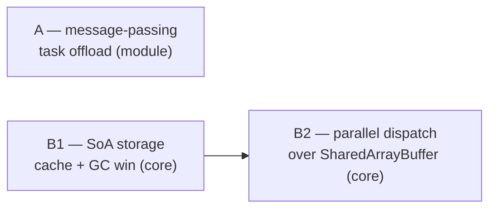

# Parallelism & SoA storage (multi-threading) — design capture, deferred

Expands the "Multi-threading / worker-based parallelism" Non-goal in
[../roadmap/ecs-module-backlog.md](../roadmap/ecs-module-backlog.md#non-goals-declined).
That entry declined the topic on a single argument (`structuredClone`
copy cost). This doc records the fuller picture so the question isn't
re-litigated from scratch: what would actually be built, in what order,
what each piece is worth **on its own**, and how each would be proven.

Nothing here is scheduled. This is a design capture, kept deferred until
a prototype produces the evidence each step demands (see
[Evidence-first sequence](#evidence-first-sequence)).

## Two facts that shape everything

- **Component data is objects in a `Map`.** `ComponentStore<T>` holds each
  component as a JS object in a `Map<EntityId, T>`
  ([../../src/component-store.ts](../../src/component-store.ts)). It is *not*
  a Structure-of-Arrays over typed buffers. This is the real blocker for
  true shared-memory parallelism — not `structuredClone`.
- **The scheduler already knows read/write sets.** Every `SchedulableSystem`
  declares `reads` / `writes`, documented as the "Foundation for future
  parallel execution"
  ([../../src/scheduler.ts](../../src/scheduler.ts)). The dependency
  metadata needed to auto-dispatch disjoint systems already exists.

## Three levers, not one

The backlog entry conflates two unrelated things. There are really three,
and they serve different purposes:

| Step | What it is | Standalone value | Depends on | Core / module |
|---|---|---|---|---|
| **A** | Message-passing worker(s) — offload whole jobs | Yes | nothing | **module** (worker-pool helper) |
| **B1** | SoA / typed-array "hot component" storage | **Yes, large** (cache + GC wins, single-threaded) | nothing | **core** (`ComponentStore`) |
| **B2** | Parallel system dispatch over SAB-backed SoA | Only as a multiplier on B1 | **B1** | **core** (scheduler + world) |

A is independent. B1 is independent and worth doing alone. B2 is the only
step that requires a predecessor.

### Task parallelism (A) vs data parallelism (B2)

A is **not** a naive version of B2 — they solve different problems and both
are legitimate permanent choices:

- **A = task parallelism.** Distinct, self-contained jobs whose input/output
  is small relative to the compute: pathfinding / flow-field solves,
  procedural generation, AI planning, asset decoding, audio DSP. The copy
  across the boundary is negligible; A is simpler, safer, and more portable
  than B2 (no cross-origin isolation, no data races, no manual byte layout).
  It is also the *only* option for non-numeric work — a `SharedArrayBuffer`
  holds only numbers.
- **B2 = data parallelism.** The same operation across a large uniform
  array ("advance 10k positions", "test 10k pairs"). Needs shared typed
  memory (hence B1).

The only genuinely naive move is using A to parallelize the per-tick ECS
loop — that specific use is dominated by copy cost. A for batch jobs is
battle-tested (it is how most JS games offload today, since SAB was
disabled for years and still needs `COOP`/`COEP` headers).

## A — message-passing worker offload (module)

**Shape.** A small worker-pool helper: hand it a job (a pure function +
serializable input), get a `Promise` of the result back. Consumers opt in
per job; nothing runs in a worker by default.

**Electron.** Works. Electron is Chromium + Node — Web Workers are native.
(Node `worker_threads` also exist, but Web Workers keep one codebase
running in both browser and Electron.)

**Pros.** No frame stalls for heavy one-offs; simple; safe; portable;
handles non-numeric work.

**Cons.** Copy cost per job → unsuitable for per-tick simulation; result
latency (answer arrives a frame or more later).

## B1 — SoA / hot-component storage (core)

**Shape.** A hybrid store. Keep the `Map`-of-objects as the default
(ergonomic, flexible, fine for cold or non-numeric components); add an
opt-in path where a consumer marks a numeric component (position, velocity)
as **Structure-of-Arrays** — one contiguous `Float32Array` per field,
indexed by a dense slot, with an entity↔slot table.

**Value is independent of parallelism.** Unity DOTS, flecs, EnTT, and Bevy
adopted this layout for the *single-threaded* cache wins first; parallelism
came later.

**Pros (single-threaded).**

- **Iteration speed:** streaming a contiguous typed array is cache-friendly
  and prefetcher-friendly; the `Map` version chases a pointer per entity.
  Routinely 2–10× on hot loops.
- **No per-entity GC:** one big allocation instead of thousands of tracked
  objects; writing a component is `xs[slot] = v` — nothing for the GC to
  scan. Removes spawn/kill stutter at high counts.
- **Small, predictable footprint.**

**Cons (real, beyond effort).**

- Only fixed-width numbers fit → strings / arrays / nested objects stay in
  the `Map`, so core carries **two storage paths**.
- Requires an up-front declared numeric schema per hot component (stricter
  than today's opaque `serialize` / `deserialize<T>`).
- Slot bookkeeping: free-list / swap-remove / hole handling; add/remove
  component is no longer trivial.
- Harder to inspect (a `Float32Array` + slot table vs a `Map` of objects).
- A philosophical pivot away from the object-first `simpleComponent` model.

The hybrid (opt-in per component) is what keeps the cons contained: the 90%
of components that don't dominate the tick never leave the `Map`.

## B2 — parallel system dispatch (core, needs B1)

**Shape.** Back B1's typed arrays with a `SharedArrayBuffer`; let the
scheduler auto-dispatch systems whose `reads` / `writes` sets are disjoint
onto a worker pool. Opt-in at the world/scheduler level ("enable parallel
mode") — consumers do **not** rewrite systems; the existing read/write
metadata is what makes a system parallel-safe.

**Electron.** Works, and is the *easier* SAB target — you control the
`COOP`/`COEP` headers / launch flags that a plain browser makes fiddly.

**Pros.** ~Nx on genuinely CPU-bound simulation (bounded by core count).

**Cons.** Only helps work that is *already* CPU-bound after B1; worker sync
overhead can make a light kernel *slower* in parallel; only SoA components
can be shared; correctness rests on accurate `reads` / `writes` declarations.

## Would this help a "vampire survivors"-style game?

Partially, and **not first.** Two separate bottlenecks:

- **Simulation** of thousands of entities: the big wins are B1 (cache + no
  GC) and the spatial broadphase already in
  [../../src/spatial-structure.ts](../../src/spatial-structure.ts). A single
  thread with tight data layout handles 10k+ at 60fps. B2 adds a core-count
  multiplier *only after* B1, and only if still CPU-bound.
- **Rendering** thousands of sprites is a draw-call / fill-rate problem.
  Workers do not fix it (draw happens on the main thread; `OffscreenCanvas`
  moves it to *one* worker — offloading, not parallelism).

So for a VS-like: B1 is the lever that matters, B2 is the last resort, and
rendering needs a separate batching answer.

## Proof-of-benefit demos

Each lever produces a *different kind* of win, so one FPS number can't show
all three. Three minimal, boids-style demos, each with a toggle:

- **A — "no stutter" (smoothness, not FPS).** A few hundred drifting dots +
  a "recompute" button firing a deliberately heavy job (~200 ms). Toggle
  OFF (main thread) → the animation visibly hitches; ON (worker) → stays
  smooth, result pops in when ready. Watch a **frame-time graph**: one giant
  spike vanishes. Average FPS barely moves — the spike is the story.
- **B1 — "SoA vs Map" (throughput at scale).** Slider ramps entity count
  (1k → 100k), integrate every tick, render as 1px dots (render kept cheap
  so *simulation* is the bottleneck). Toggle Map-store ⟷ SoA-store for
  pos/vel. Watch **sim ms/tick** (not FPS — vsync hides headroom): the `Map`
  path climbs with a GC sawtooth; SoA stays flat. Ramp until the `Map`
  version drops frames.
- **B2 — "single vs parallel" (throughput × cores).** B1's scene plus a
  deliberately heavy, embarrassingly-parallel per-entity kernel (naive
  attraction to K attractors, no spatial shortcut). Toggle single ⟷ N-worker
  dispatch over the SAB arrays. Watch **sim ms drop ~Nx**. A "kernel weight"
  slider reveals the crossover where parallel starts to beat single-thread.

B1 and B2 can share one stress example with two checkboxes (SoA on/off,
parallel on/off), since B2 needs B1 — you watch ms/tick step down twice. A
is a separate example (its win is smoothness, not throughput).

## Evidence-first sequence

The engine ships nothing speculative (canon + real consumers). The demos
above need the features, and the features need a proven bottleneck —
chicken-and-egg. The break: build each **harness against today's code
first**; if it visibly chokes, that is the evidence that authorises the
build, with zero speculative engine code written.

- [ ] Build the B1 stress harness on the **current `Map` store**; confirm it
      chokes (frame drops + GC sawtooth) at high entity count. → justifies B1.
- [ ] If justified, design + build B1 (hybrid opt-in SoA hot components);
      re-run the harness with the toggle to quantify the win.
- [ ] Build the A "main-thread stall" harness; confirm the stall on the main
      thread. → justifies A (a module).
- [ ] Build the B2 fat-kernel harness on B1; confirm it is core-bound single-
      threaded. → justifies B2 (SAB dispatch).

## Relationship to the backlog

This supersedes the reasoning in the multi-threading Non-goal. The *core*
version (B1 + B2) stays deferred — but the honest blockers are the
`Map`-of-objects storage and the absence of a proven-CPU-bound prototype,
not `structuredClone`. The *module* version (A) was never really the same
question and could land on its own the moment a consumer needs to offload a
heavy job without stalling a frame.
